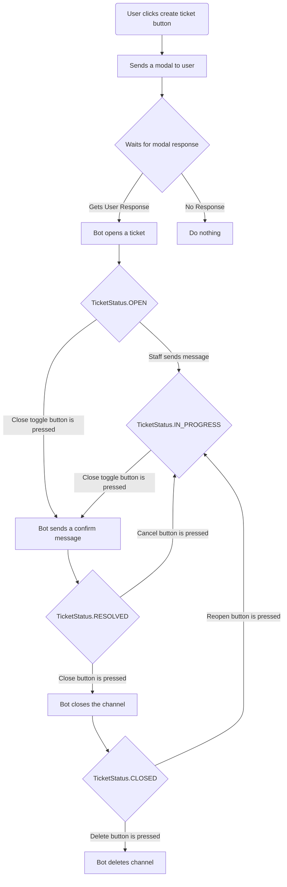

# Dragon Bot Documentation

<!--toc:start-->
- [Dragon Bot Documentation](#dragon-bot-documentation)
- [Ticket System](#ticket-system)
  - [Subsystem](#subsystem)
- [Keyword System](#keyword-system)
- [Role Requesting System](#role-requesting-system)
- [TODOs](#todos)
  - [Bug reporting system](#bug-reporting-system)
    - [Proposal](#proposal)
<!--toc:end-->

Welcome to the Dragon Bot Documentation. This discord Bot is crafted specifically for the server [Dragon龍龍]( https://discord.com/invite/d84bdeR ).

# Ticket System

The flow chart (simplified, for detailed look at the dedicated page.) of the ticket system:

> This system is generalized to work across multiple servers , though the ticket id is not unique now.

## Subsystem

- Feedback system
  A system that allows ticket participants to provide feedback on the ticket resolution process. This helps improve the quality of support provided.
  
# Keyword System

The keyword system allows server administrators to set up keywords that trigger specific responses from the bot. This is useful for automating responses to frequently asked questions or common topics.

# Role Requesting System

This system allows users to request roles, which can then be approved or denied by administrators. It includes a configuration command to set up the channels and manage requestable roles.

# TODOs

## Bug reporting system

### Proposal

A bug reporting system that allows server administrators to report bugs to developers from discord, open an issue on GitHub automatically and using github webhook for discord to a dedicated development server.  
This should also include a way for users to report bugs, which can then be approved by administrators before being sent to developers to prevent abusing.
